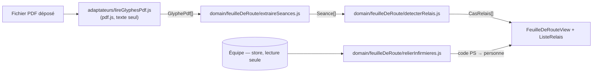

# 09 — Feuille de route : lecture des séances Vega et reversements

L'écran **Feuille de route** (`/feuille-de-route`) lit la « Liste des séances sur une période » exportée de **Vega** (PDF), repère les patients soignés le même jour par **plusieurs infirmières**, et calcule **qui reverse combien à qui**. Tout se passe dans le navigateur : rien n'est envoyé, rien n'est conservé.

Historique des décisions : [feature 0033](../../features/0033-feuille-de-route.md), [feature 0034](../../features/0034-initiales-vega-et-reversements.md). Choix de la bibliothèque : [ADR 0019](../adr/0019-lecture-pdf-pdfjs.md).

## Chaîne de traitement

| Étape | Module | Nature | Rôle |
|---|---|---|---|
| Lecture | `src/adaptateurs/lireGlyphesPdf.js` | I/O navigateur (hors domaine) | `File` → fragments de texte positionnés `{page, x, y, largeur, str}`. pdf.js chargé **à la demande** (chunk + worker séparés). |
| Extraction | `src/domain/feuilleDeRoute/extraireSeances.js` | pur | fragments → séances `{date, ps, heure, patient, cotation, montantCentimes, fin}` + période. |
| Détection | `src/domain/feuilleDeRoute/detecterRelais.js` | pur | séances → cas, parts, reversements. |
| Liaison | `src/domain/feuilleDeRoute/relierInfirmieres.js` | pur | code PS → personne via `Personne.initialesVega`. |
| Affichage | `src/views/FeuilleDeRouteView.vue`, `src/components/feuilleDeRoute/` | UI | états attente / analyse / erreur / résultat. Aucune logique métier. |

Les modules de `src/domain/feuilleDeRoute/` n'utilisent que des **imports relatifs** (pas d'alias `@/`) pour rester exécutables tels quels par Node lors des vérifications.

## Format Vega attendu

Le PDF est un tableau, écrit glyphe par glyphe, que pdf.js restitue en fragments (mots ou cellules entières) avec leur position.

- **Ligne d'en-tête** (répétée à chaque page) : `PS · Heure · Bénéficiaire · Cotation · Montant · Actes · Nuit · Dim · IF · Km · IK · DE · Facture · Fin`. Elle est reconnue si elle contient au moins `PS, Heure, Bénéficiaire, Cotation, Montant, Fin` ; l'abscisse de chaque intitulé définit le début de sa colonne.
- **Ligne de jour** : `Jeudi 08/10/2026` → date courante `2026-10-08` (date calendaire réellement valide, sinon ignorée avec les séances qui suivent).
- **Ligne de séance** : PS sur 2 à 4 caractères `[A-Z0-9]` (`FC`, `LR`, `EMM`…) + heure `HH:mm`.
- Ignorés : pieds de page (`Vega5 … Imprimé le … Page N`), totaux (`N séances pour un total de …`).

Règles d'extraction :

- Fragments regroupés en **lignes** par page et par `y` (tolérance `TOLERANCE_LIGNE` = 1,5 pt), fragments blancs écartés.
- Chaque fragment va dans la **dernière colonne connue** dont le début − `TOLERANCE_COLONNE` (2 pt) ≤ son `x`. Les colonnes viennent d'une **liste blanche** : le texte du PDF ne crée jamais de colonne (sinon « Cotation » avalerait Montant, Actes…).
- **Montant** (`20,95`) → centimes entiers (`2095`), parse strict `^\d{1,6},\d{2}$`, sinon `null`. C'est la colonne **Montant** (total de la ligne) qui compte, pas « Actes ».
- **Fin** (`dd/mm/yy`, fin de prise en charge) → `20yy-mm-dd`, `null` si absente ou invalide.

## Règle de détection

Pour chaque groupe **même date + même patient (normalisé) + même Fin** :

1. le groupe doit contenir au moins une séance dont la cotation commence par `BSA`, `BSB` ou `BSC` (soin de base) ;
2. **passages** = toutes les séances du groupe, triées par heure ; `N` = leur nombre (2 = matin + soir, 3 = matin + midi + soir) ;
3. le cas est signalé si au moins **deux codes PS distincts** y interviennent.

La **Fin** distingue deux prises en charge simultanées d'un même patient ; le **nom** distingue deux patients qui auraient la même Fin. Il n'y a **pas** de coupure horaire matin / après-midi : seule la position du passage donne son libellé (`libelleMoment` : Matin / Soir, Matin / Midi / Soir, sinon « Passage n »).

## Répartition et reversements

Dans la réalité, la Sécurité sociale paie **chaque ligne à l'infirmière de la ligne** : celle du matin touche le soin (BSx) + le déplacement (IFI), les passages suivants seulement le déplacement. Le cabinet répartit équitablement **par passage**. Tous les calculs sont en **centimes entiers**.

| Grandeur | Calcul |
|---|---|
| `totalCentimes` | somme des montants du groupe (`null` si un montant est illisible → `montantIncomplet`, ni parts ni reversements) |
| `partCentimes` | `total × passages de l'infirmière ÷ N`, arrondi ; la **dernière** infirmière (ordre de première apparition) reçoit le reste, pour que Σ parts = total |
| `toucheCentimes` | somme des montants de **ses** lignes |
| `ecartCentimes` | `touche − part` (positif = doit reverser) ; Σ écarts = 0 |
| `reversements` | glouton : le plus gros débiteur verse au plus gros créancier le minimum des deux, jusqu'à épuisement (déterministe, nombre de virements minimal en pratique) |

Exemples de référence (vérifiés sur les PDF de test) :

| Passages | Total | Parts | Touché | Reversement |
|---|---|---|---|---|
| FC 20,95 · LR 2,75 | 23,70 | FC 11,85 · LR 11,85 | FC 20,95 · LR 2,75 | FC → LR **9,10 €** |
| FC 20,95 · FC 2,75 · LR 2,75 | 26,45 | FC 17,63 · LR 8,82 | FC 23,70 · LR 2,75 | FC → LR **6,07 €** |

## Liaison avec l'équipe

Le code PS est relié à une personne par `Personne.initialesVega` (casse ignorée ; en cas de doublon, la personne active l'emporte). Affichage « Prénom Nom (FC) », ou le code seul avec la mention « code Vega non relié à l'équipe » ; un encart liste les codes non reliés avec un lien vers Équipe. Les mêmes initiales servent de repère dans les pastilles de personne et sur le planning imprimé (à défaut : première lettre du prénom).

## Sécurité et confidentialité

Le PDF contient des **données de santé** (noms de patients) et est un **fichier non fiable**.

- **Rien n'est conservé** : ni le fichier, ni les fragments, ni les séances ; la vue ne garde en mémoire que ce qu'elle affiche, perdu en quittant la page. Pas de Vuex, pas de `storageRepository`, aucun `console.*`.
- **Rien n'est envoyé** : pdf.js reçoit les octets en mémoire ; `cMapUrl`, `standardFontDataUrl`, `wasmUrl` à `null` ; seuls le chunk pdf.js et son worker sont chargés, depuis l'origine du site.
- **Durcissement pdf.js** : `isEvalSupported: false`, `enableXfa: false`, `stopAtErrors: true`, `disableAutoFetch`, `disableStream`, extraction de texte uniquement (aucun rendu).
- **Plafonds** : 20 Mo (`TAILLE_MAX_PDF_OCTETS`), 200 pages (`NB_PAGES_MAX`), 200 000 fragments (`NB_FRAGMENTS_MAX`).
- **Robustesse** : toute la chaîne est sous un seul `try/catch` (l'écran ne reste jamais bloqué en « Lecture… ») ; le texte du PDF n'indexe jamais d'objet littéral (`Map` + liste blanche) ; rendu par interpolation uniquement (pas de `v-html`).
- Les exports Vega et les sauvegardes réelles vivent dans `files/`, ignoré par git.

Codes d'erreur affichés (messages dans `FeuilleDeRouteView.vue`) : `PLUSIEURS_FICHIERS`, `PAS_PDF`, `TROP_VOLUMINEUX`, `PDF_ILLISIBLE`, `PDF_TROP_COMPLEXE`, `AUCUNE_SEANCE`, `LECTEUR_INDISPONIBLE`.

## Limites connues

- **Dépendance au format Vega** : un changement de mise en page (intitulés de colonnes, format des lignes de jour) peut rendre la lecture impossible → erreur `AUCUNE_SEANCE`, jamais un résultat faux silencieux pour une colonne absente.
- Un fichier à la fois ; pas de cumul sur plusieurs exports (bilan mensuel « qui doit quoi » prévu en feature 0035).
- Pas de CSP posée sur le site : la garantie « rien n'est envoyé » repose sur le code, pas sur le navigateur.

## Vérifier après une modification

Pas de test runner : `npm run build`, puis un script Node jetable **hors dépôt** qui lit un PDF avec `pdfjs-dist/legacy/build/pdf.mjs` (mêmes options que l'adaptateur), construit les fragments comme l'adaptateur et appelle `extraireSeances` + `detecterRelais`. Attendus sur les PDF de test de `files/` : `Vega_UnDoublon.pdf` → 348 séances, 1 cas, FC → LR 9,10 € ; `Vega_TroisDoublons.pdf` → 349 séances, 1 cas, FC → LR 6,07 €.
